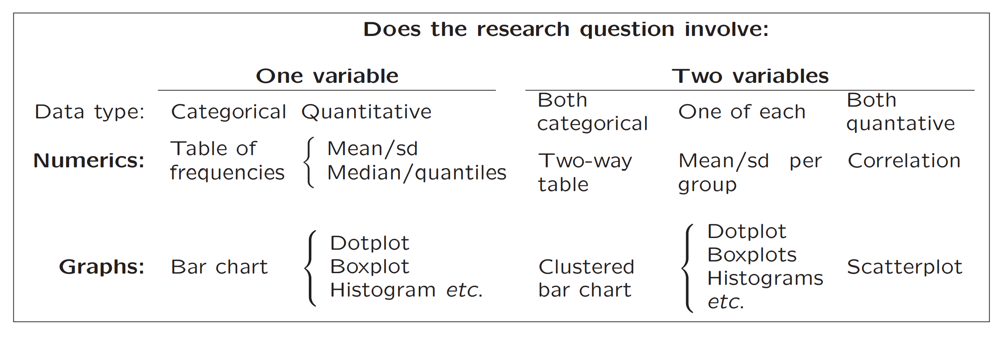
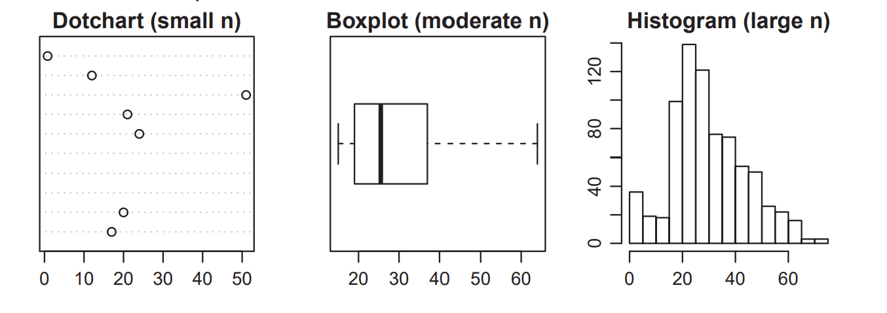
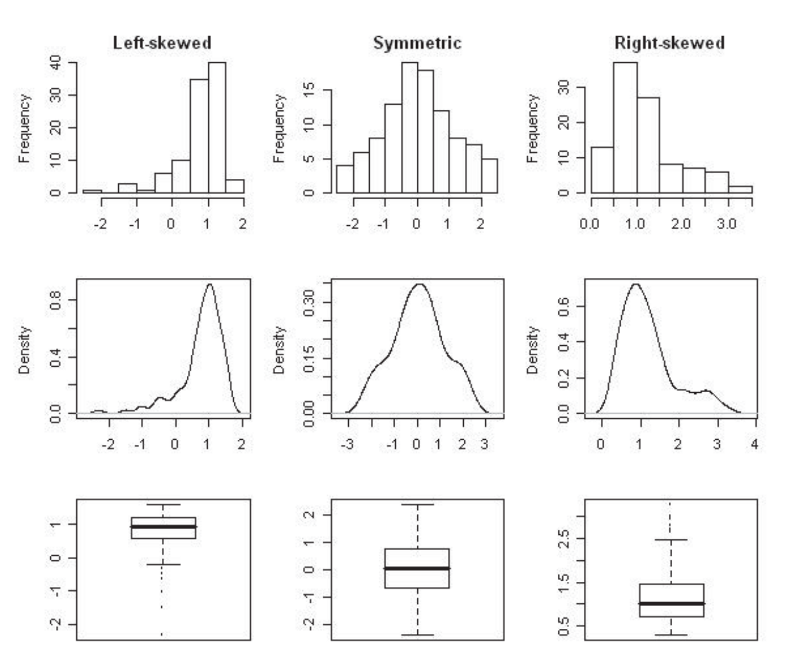
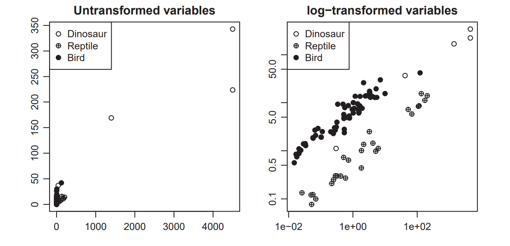
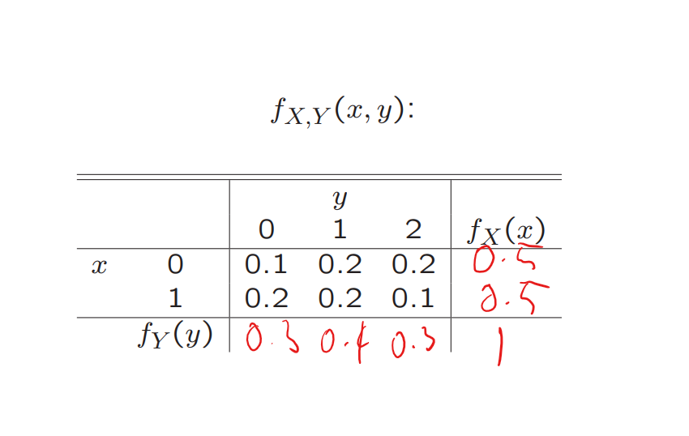
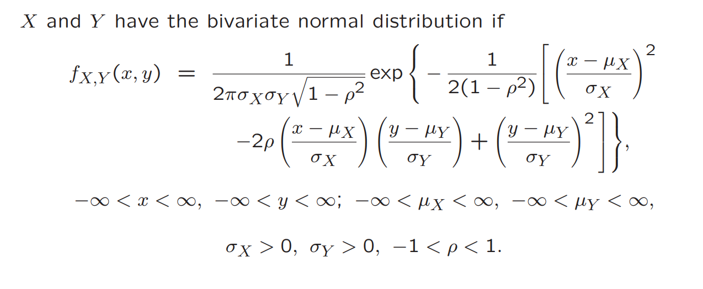

```{r setup, include=FALSE}
setwd("~/Uni/2019T2/MATH2801/Notes/R Notes")
```

# Chapter 1: Descriptive statistics

2 Steps to Data Analysis:

1. What is the research question?

2. What properties of the variables of primary interest?

2 Types of variables:

* Categorical \(\rightarrow \) Responses can be sorted into a finite set of unordered categories
* Quantitative \(\rightarrow \) Responses are measured on some sort of scale



## Categorical Data

Problems that summarise one categorical variable and the association between two categorical variables are extremely similar in scope so we'll cover both here.  

### Numerical summaries of cateogircal data

The main tool is a table of frequencies (both one way for a single variable and two way for two variables)

One way table:

| Party | Liberal | Labor |
|-------|---------|-------|
|       | 300     | 295   |

Two way table:

|        | Survived | Died |
|--------|----------|------|
| Male   | 142      | 709  |
| Female | 308      | 154  |


### Graphical summaries of categorical data

2 types:

* Bar chart of frequencies \(\rightarrow\) 1 var

* Clustered bar chart (of frequencies) \(\rightarrow\) 2 vars


DON'T USE PIE CHARTS U DUMB FUCKS


## Quantitative Data

3 things to look at

* Location (or "centre") \(\rightarrow\) a value around which most of the data lies
* Spread \(\rightarrow\) how variable the values are around the centre
* Shape \(\rightarrow\) other information regarding the distribution of data

### Numerical summaries

Sample mean:
\[
\bar{x} = \frac{1}{n} \sum_{i=1}^n x_i
\]

Sample variance:
\[
s^2 = \frac{1}{n-1} \sum_{i=1}^n (x_i - \bar{x})^2
\]

Sample deviation:
\[
s = \sqrt{s^2}
\]


Sample median
\[
\tilde{x}_{0.5} = \left\{ \begin{array}{l}
x_{(\frac{n+1}{2})} \text{     if n is odd} \\
\frac{1}{2}(x_{(\frac{n}{2})} +x_{(\frac{n+2}{2})})  \text{     if n is even}
\end{array}
\right.
\]

pth sample quantile:

\[
\tilde{x}_p = x_{(k)} \quad \text{where} \quad p = \frac{k-0.5}{n} \quad \text{for} \quad k \in \{1,2,3,\ldots,n\}
\]


Inter-quartile Range:
\[
IQR = \tilde{x}_{0.75} - \tilde{x}_{0.25}
\]

Range based observations (IQR, median, ) are much less sensitive to outliers than other measures (mean, variance, sd)

### Graphical summaries of quantitative data


Kernel density estimator:
\[
\hat{f_h}(x) = \frac{1}{n} \sum_{i=1}^{n} w_h(x-x_i) \\
h \rightarrow \text{bandwidth parameter}
\]

### Shape of a distribution

Here are some sample distributions in 3 different skews:


It's also worth checking for outliers that can influence the shape of the data

## Summarising Associations Between Variables

correlation coefficient (2 quant vars):

\[
r = \frac{1}{n-1} \sum_{i=1}^{n} (\frac{x_i - \bar{x}}{s_x})(\frac{y_i - \bar{y}}{s_y}) \
\]
where \(\bar{x}\) and \(s_x\) are the sample mean and standard deviation of \(x\),similarly for \(y\).

3 Types of result:

* \(|r| \leq 1\)
* \(r = -1\)
* \(r = 1\)

Where the second and third results are linear relationships between the two variables (negative and positive gradient)

2 measures:

* Relationship strength \(\rightarrow\) how close \(r\) is to -1 or 1
* Direction of association \(\rightarrow\) values less than one suggest a decreasing
relationship, values greater than one suggest an increasing relationship

### Associations between categorical and quantitative variables

Just use a comparative box plot smh


## Transforming Data

### Linear transformations
Linear Transformations take the shape of 
\[
y_i = a +bx_i
\]
for each i and b \(\neq\) 0

It doesn't affect the shape of the distribution \(\rightarrow\) only the location and spread.

A common Linear transformation is the \(z\)-score or standardised score:
\[
z = \frac{x-\bar{x}}{s_x} 
\]

It measures how many standard deviations above/below the value is from the mean (ie as \(|z| \rightarrow 1\)) the more unusual it is.


### Nonlinear transformations

The most common Non-linear transformation is a log-transformation, it can reveal interesting relationships and structures for values that may seem too close together


Important Note: 
Let (y = h(x)) be some on linear transformation of real values x. In most cases:
\[
\bar{y} \neq h(\bar{x})
\]

ie: the mean of the transform won't be equal to the mean of the original data


# Chapter 2: Random Variables

## Introduction

* A random variable is a variable that's uncertain

* Random Variables tend to occur within a sample space

Eg:
\(S = \{HHH,HHT,HTH,THH,THT,HTT,TTT\}\)

* The probability of a random variable is how often it occurs in the sample space

Eg: Let \(X\) be the number of heads. Then,
\[
Pr(X = 0) = \frac{1}{8}, \quad Pr(X = 1) = \frac{3}{8},  \quad Pr(X = 2) = \frac{3}{8},  \quad Pr(X = 3) = \frac{1}{8}.
\]


## Discrete Random Variables and Probability Functions

A random variable is discrete if there are countably many values within the sample space ie: \(X \rightarrow Pr(X=x) >0 \)

The probability structure of the discrete random variable \(X\) is given by
\[
f_X(x) = Pr(X=x)
\]

It has the following properties:
\[
f_X(x) \geq 0 \text{ for all } x \in \mathbb{R}
\]
and
\[
\sum_{\text{all } x} f_X(x) = 1
\]

eg: the probabilities from the heads and tails example add to 1:
\[
\sum Pr(X = x) = Pr(X = 0) + Pr(X = 1) + Pr(X = 2) + Pr(X = 3) =  \frac{1}{8} + \frac{3}{8} + \frac{3}{8} + \frac{1}{8} = 1
\]

## Continous Random Variables and Density Functions

The analogue of a the probability function for continuous random variables is the density function 

\[
\int_A f_X(x)dx = Pr(X \in A)
\]

It has 2 similar properties:

\[
f_X(x) \geq 0 \text{ for all } x \in \mathbb{R}
\]

and

\[
\int_{-\infty}^{\infty} f_X(x)dx = 1
\]


Therefore, for any continuous random variable \(X\) and a pair of numbers \(a \leq b\) we have 

\[
Pr(a \leq X \leq b) = \int_{a}^{b} f_X(x)dx = \text{area under } f_X \text{ between } a \text{ and } b.
\]

Hence, if you can derive \(f_X(x)\) you can derive any probability about \(X\) and hence any property of \(X\).

Continuous random variables \(X\) have the property
\[
Pr(X = a) = 0 \text{ for any } a \in \mathbb{R}
\]

Hence when we refer to them we use \(\leq, \geq\) as they are the same as \(\gt, \lt \).


## Cumulative Distribution Function

The Cumulative Distribution Function (cdf) of the random variables \(X\) is
\[
F_X(x) = Pr(X \leq x).
\]

Eg coin toss example:
\[
F_X(1) = \frac{1}{8} + \frac{3}{8} = 4/8
\]
\[
F_X(2) = \frac{1}{8} + \frac{3}{8} + \frac{3}{8} = 7/8
\]

Hence:
\[
Pr(a < X \leq b) = F_X(b) - F_X(a)
\]

To calculate \(F_X(x)\) from \(f_X(x)\) can be done as:

\[
F_X(x) = \left\{ \begin{array}{l}
\sum_{t \leq x} f_X(t)  \quad \text{ if X is discrete} \\
\int_{-\infty}^{x}f_X(t)dt \quad \text{if X is continuous}
\end{array}
\right.
\]

and vice-versa:

\[
f_X(x) = \left\{ \begin{array}{l}
F_X(x - F_X(x\_) \quad \text{ if X is discrete} \\
F'_X(x)  \quad \quad \quad \quad \quad \text{ if X is continuous}
\end{array}
\right.
\]
where \(F_X(x\_)\) is the limiting value of \(F_X(x)\) as we approach \(x\) from the negative direction.

## Quantiles

A quantile is just a percentile. 


If \(F_X\) is strictly increasing in some interval then \(F^{-1}_X\) is well defined and, for a specified \(p \in (0,1)\), the pth quantile of \(F_X\) is \(x_p\) where:
\[
F_X(x_p) = p \text{ or } x_p = F^{-1}_X(p)
\]

## Expectation and Moments of Random Variables
Expected value / mean of a discrete random variable:
\[
E(X) = \sum_{\text{all } x} x \times Pr(X = x) = \sum_{\text{all } x } xf_X(x)
\]
Expected value / mean of a continuous random variable:
\[
E(X) = \int_{-\infty}^{\infty} xf_X(x)dx
\]

### Expectation of transformed random variables

\[
E\{g(X)\} = \left\{ \begin{array}{l}
\sum_{\text{all } x} g(x) f_X(x) \quad \; \;  \text{if X is discrete} \\
\int_{-\infty}^{\infty} g(x) f_X(x)dx \quad \text{ if X is continuous}
\end{array}
\right.
\]

rth moment of \(X\) about \(a\) defined as \(E\{(X-a)^r\}\)

### Expectation of a variable under transformation
\[
E(a+bX) = a+bE(X)
\]
for both continuous and discrete

## Standard Deviation and Variance

\[
Var(X) = E\{(X-\mu)^2\} = E(X^2) - E(X)^2
\]

\[
sd = \sqrt{Var(X)}
\]


## Chebychev's Inequality 
Chebychev's Inequality is a fundamental result concerning tail probabilities of general random variables. It is useful for derivation of convergence results given later.

\[
Pr(|X -\mu|)  >k\sigma \leq \frac{1}{k^2}
\]

where \(k > 0\)  is a constant

It's often stated as:
"the probability that X is more than k standard deviations from its mean."


Chebychev's Inequality makes no assumptions about the distribution of X.

## Deriving probability Distributions

In some cases you can derive the distribution from first principles

For continuous random variables, this means attempting to derive an expression for cumulative probabilities \(F_X(x)\), then \(f_X(x) = F'_X(x)\)


## Transformation of Random Variables
### Transformations of discrete random variables
For discrete X we have:
\[
f_Y(y) = Pr(Y = y) = Pr(h(X) = y) = \sum_{x:h(x)=y} Pr(X = x)
\]

### Transformations of continuous random variables

For continuous random variable X, if h is monotonic over the set \(\{x : fX(x) > 0\}\), then

\[
f_Y(y) = f_X(x) |\frac{dx}{dy}| \\ 
\quad \quad \quad \qquad= f_X\{h^{-1}(y)\}|\frac{dx}{dy}|
\]
for \(y\) such that \(f_X\{h^{-1}(y)\} > 0\)


# Chapter 3: Common Distributions

## Summary


| Distribution                    	| Type       	| Parameters       	| \(f_X(x)\)                                                       	| Domain                     	| \(E(X)\)          	| \(Var(X)\)                                     	| Uses                                                                              	|
|---------------------------------	|------------	|------------------	|------------------------------------------------------------------	|----------------------------	|-------------------	|------------------------------------------------	|-----------------------------------------------------------------------------------	|
| Bernoulli                       	| Discrete   	| \(p\)            	| \(p^{x}(1-p)^{1-x}\)                                             	| \(\{0,1\}\)                	| \(p\)             	| \(p(1-p)\)                                     	| A single trial with two possible outcomes (Bernoulli trial)                       	|
| Binomial - \(Bin(n,p)\)         	| Discrete   	| \(n,p\)          	| \(\binom{n}{x}p^{x}(1-p)^{n-x}\)                                 	| \(\{0,1,2,\dots,n\}\)      	| \(np\)            	| \(np(1-p)\)                                    	| Number of successes from n independent Bernoulli trials.                          	|
| Geometric                       	| Discrete   	| \(p\)            	| \(p(1-p)^{x-1}\)                                                 	| \(\{1,\dots\}\)            	| \(\frac{1}{p}\)   	| \(\frac{1-p}{p^2}\)                            	| Number of independent Bernoulli trials until first success.                       	|
| Hypergeometric                  	| Discrete   	| \(n,m,N\)        	| \(\frac{\binom{m}{x}\binom{N-m}{n-s}}{\binom{N}{n}}\)            	| \(\{0,1,\dots,min(m,n)\}\) 	| \(\frac{nm}{N}\)  	| \(\frac{nm}{N}(1-\frac{m}{N})\frac{N-n}{N-1}\) 	| Number of successes in a sample of size n from N items, of which m are successes. 	|
| Poisson                         	| Discrete   	| \(\lambda\)      	| \(\frac{e^{-\lambda}\lambda^{x}}{x!}\)                           	| \(\{0,1,2,\dots\}\)        	| \(\lambda\)       	| \(\lambda\)                                    	| Counting independent events(that have constant occurrence probability).           	|
| Exponential                     	| Continuous 	| \(\beta\)        	| \(\frac{1}{\beta}e^{\frac{-x}{\beta}}\)                          	| \(x > 0\)                  	| \(\beta\)         	| \(\beta^2\)                                    	| Time between independent events (that have constant occurrence probability).      	|
| Uniform                         	| Continuous 	| \(a,b\)          	| \(\frac{1}{b-a}\)                                                	| \(b > x > a\)              	| \(\frac{a+b}{2}\) 	| \(\frac{(b-a)^2}{12}\)                         	| An event with constant probability within some interval (a,b).                    	|
| Normal - \(N(\mu,\sigma^2)\)    	| Continuous 	| \(\mu,\sigma^2\) 	| \(\frac{1}{\sigma\sqrt{2\pi}}e^{-\frac{(x-\mu)^2}{2\sigma^2}}\)  	| \(\infty > x > -\infty \)  	| \(\mu\)           	| \(\sigma^2\)                                   	| Useful for some variables (e.g. height) but mostly for inference.                 	|
| Gamma - \(Gamma(\alpha,\beta)\) 	| Continuous 	| \(\alpha,\beta\) 	| \(\frac{e^{-x/\beta}x^{\alpha-1}}{\Gamma(\alpha)\beta^\alpha }\) 	| \(x > 0\)                  	| \(\alpha\beta\)   	| \(\alpha\beta^2\)                              	| Generalisation of the exponential.                                                	|


## Chebyshev's Inequality 

Chebychev's Inequality is "the probability that \(X\) is more than \(k\) standard deviations from its mean."

Mathematically, it is expressed as:
\[
Pr(|X-\mu| >k\sigma) \leq \frac{1}{k^2}
\]


# Chapter 4: Bivariate Distributions

Observations are often taken in pairs \(\rightarrow\) one observation of two variables

Often we need to look at the relationship between 2 variables.

## Joint Probability and Density Function

The probability that \(X = x \text{ and } Y = y\)
\[
f_{X,Y}(x,y) = Pr(X=x,Y=y)
\]

### Solving Discrete Joint probability problems

1. Tabulate the variable
2. Work out the joint probabilities by multiplying them
3. Read either the single cell or the addition of the row/col

## Joint Density Functions

The joint density function of continuous random variables is a bivariate function with the property
\[
\int \int_A f_{X,Y}(x,y)dxdy = Pr((X,Y) \in A)
\]

for any subset \(A\) of \(\mathbb{R}^2\)

### Solving Joint Density problems

1. Figure out the area you want to integrate over

2. Insert the limits into the integrals of the joint density function

3. Integrate with respect to x and Integrate with respect to y (using the limits)

4. Solve

Alternately you could integrate with respect to x and y and then substitute the values into the new, integrated equation

## Marginal Probability/Density Functions

### Discrete
\[
f_X(x) = \sum_{\text{all } y} f_{X,Y}(x,y)
\]

\[
f_Y(y) = \sum_{\text{all } x} f_{X,Y}(x,y)
\]

Example:



### Continuous


\[
f_X(x) = \int^\infty_{-\infty} f_{X,Y}(x,y) dy
\]

\[
f_Y(y) = \int^\infty_{-\infty} f_{X,Y}(x,y) dx
\]

## Conditional Probability and Density Functions

Firstly Recall Bayes Rule:
\[
P(A|B) = \frac{P(B|A)P(A)}{P(B)} = \frac{P(A \cap B)}{P(B)}, \text{ if } P(B) \neq 0 
\]

The following applications are just applications of this rule to discrete and continuous probabilities
### Discrete

\[
f_{X|Y}(x|y) = Pr(X = x | Y = y) = \frac{Pr(X = x , Y = y)}{Pr(Y=y)} = \frac{f_{X,Y}(x,y)}{f_Y(y)}
\]

The opposite is also true for \(f_{Y|X}(y|x)\).


\[
Pr(Y \in A |X = x) = \sum_{y \in A} f_{Y|X}(y|X = x)
\]

### Continous

\[
f_{X|Y}(x|Y=y) = \frac{f_{X,Y}(x,y)}{f_Y(y)}
\]
The opposite is also true for \(f_{Y|X}(y| X = x)\).

\[
Pr(a \leq Y \leq b | X = x) = \int_a^b f_{Y|X}(y|x) dy
\]

## Conditional Expected Value and Variance

### Expected Value
The conditional expected value of \(X\) given \(Y = y\) is
\[
E(X|Y = y) = \left\{ \begin{array}{l}
\sum_{\text{all } x} xPr(X=x | Y = y)\quad   \text{if X is discrete} \\
\int_{-\infty}^{\infty} xf_{X|Y}(x|y)dx \quad \quad \quad \quad \;\text{if X is continuous}
\end{array}
\right.
\]

Similarly,

\[
E(Y|X = x) = \left\{ \begin{array}{l}
\sum_{\text{all } x} yPr(Y = y | X = x)\quad   \text{if Y is discrete} \\
\int_{-\infty}^{\infty} yf_{Y|X}(y|x)dx \quad \quad \quad \quad \;\text{if Y is continuous}
\end{array}
\right.
\]

### Variance

\[
Var(X|Y=y) = E(X^2 | Y=y) - \{E(X| Y=y)\}^2 
\]

Where:
\[
E(X^2|Y = y) = \left\{ \begin{array}{l}
\sum_{\text{all } x} x^2Pr(X=x | Y = y)\quad   \text{if X is discrete} \\
\int_{-\infty}^{\infty} x^2f_{X|Y}(x|y)dx \quad \quad \quad \quad \;\text{if X is continuous}
\end{array}
\right.
\]

This also applies to \(Var (Y|X =x) \)

### Independent Random Variables

A Variable is independent if and only if:
\[
f_{Y|X}(y|x) = f_Y(y)
\]
or similarly

\[
f_{X|Y}(x|y) = f_X(x)
\]

And hence 

\[
F_{X,Y} = F_X(x) \times F_Y(y)
\]

also hence 

\[
E(XY) = E(X) \times E(Y) \\
\text{or more generally:} \\
E(g(X) \times h(Y)) = E\{g(X)\} \times E\{h(Y)\}
\]

## Covariance and Correlation
### Covariance

\[
Cov(X,Y) = E\{(X-\mu_X)(Y-\mu_Y)\} \\
\text{where } \mu_X = E(X) \text{ and } \mu_Y = E(Y)
\]

The covariance measures how \(X\) and \(Y\) vary together linearly. If it's \(> 0\) then \(X\) and \(Y\) are positively associated.(ie: They move along their axis the same way \(\rightarrow\) if \(X\) is big then \(Y\) will be big). 

The inverse is true for \(< 0\) \(\rightarrow\) if \(X\) is small then \(Y\) will be big).

Here are 2 more results from the covariance:


\[
Cov(X,X) = Var(X)
\]
this one is kinda self explanatory 


\[
Cov(X,Y) = E(XY) - \mu_X\mu_Y = E(XY) -E(X)E(Y)
\]

X and Y will be independent if \(Cov(X,Y) = 0\)

Covariance also comes into play when finding bivariate variance transforms:

\[
Var(aX+bY) = a^2Var(X) + 2abCov(X,Y) + b^2Var(Y)
\]
Hence:

\[
Var(X+Y) = Var(X) + 2Cov(X,Y) + Var(Y)
\]

If \(X\) and \(Y\) are independent:
\[
Var(X+Y) = Var(X) + Var(Y)
\]

\[
Var(X-Y) = Var(X) + Var(Y)
\]

### Correlation
\[
Corr(X,Y) = \frac{Cov(X,Y)}{\sqrt{Var(X) \times Var(Y)}}
\]

The correlation measures the strength of the relationship between \(X\) and \(Y\).

If \(Corr(X,Y) = 0\) then the two variables are uncorrelated.

Correlation will *always* lie between -1 and 1. As it moves away from zero the relationship becomes *stronger*. When Correlation reaches -1 or 1 the to variables are *linearly correlated* meaning that they can be expressed in the form \(Y = a+bX\).


### The Bivariate Normal Distribution



Where 
\[
p = Corr(X,Y)
\]

Below is a 3d bivariate normal distribution. Stolen from [here](https://plot.ly/~erikjan/1/bivariate-normal-distribution/#plot)

```{r bivarnorm, echo=FALSE, message=FALSE, warning=FALSE}
# this code has been stolen from https://plot.ly/~erikjan/1/bivariate-normal-distribution/#plot
library(plotly)
trace1 <- list(
  name = "rho = 0.5", 
  type = "surface", 
  z = matrix(c(6.85385652608549e-07, 1.08875660387304e-06, 1.65494718691519e-06, 2.40710491299967e-06, 3.35014375504486e-06, 4.46158745483381e-06, 5.6855557330808e-06, 6.93288466483557e-06, 8.08933038220393e-06, 9.03168358940749e-06, 9.64900206007282e-06, 9.86401280516179e-06, 9.64900206007282e-06, 9.03168358940747e-06, 8.08933038220393e-06, 6.93288466483557e-06, 5.6855557330808e-06, 4.46158745483381e-06, 3.35014375504487e-06, 2.40710491299967e-06, 1.65494718691519e-06, 1.08875660387304e-06, 6.85385652608549e-07, 4.12854249545934e-07, 2.3796662593588e-07, 1.31248059206526e-07, 6.92671423271557e-08, 3.49799508596854e-08, 1.69031895941876e-08, 7.81584024654418e-09, 3.45812134590718e-09, 1.46407163560979e-09, 5.93119180386751e-10, 2.29921272150742e-10, 8.52852412756319e-11, 3.02709572412295e-11, 1.02810144678509e-11, 3.34120659136823e-12, 1.03903034693214e-12, 3.09179491340632e-13, 8.80340471664798e-14, 2.3985468245095e-14, 6.253213803181e-15, 1.55996874847396e-15, 3.72379754859776e-16, 1.08875660387304e-06, 1.76806335804153e-06, 2.74740313072724e-06, 4.08511697971867e-06, 5.81224816892068e-06, 7.91300326391e-06, 1.03085144462415e-05, 1.28501550054559e-05, 1.53277423793534e-05, 1.74946622278869e-05, 1.91069107469893e-05, 1.99679247532319e-05, 1.99679247532319e-05, 1.91069107469893e-05, 1.74946622278869e-05, 1.53277423793535e-05, 1.28501550054559e-05, 1.03085144462415e-05, 7.91300326391e-06, 5.81224816892068e-06, 4.08511697971868e-06, 2.74740313072725e-06, 1.76806335804153e-06, 1.08875660387304e-06, 6.41536431699474e-07, 3.61717390986504e-07, 1.95152895191532e-07, 1.00748398452481e-07, 4.97689922571431e-08, 2.35254037966872e-08, 1.06407654290832e-08, 4.60538769148607e-09, 1.90729146730548e-09, 7.55832355767125e-10, 2.86610064097633e-10, 1.0399559324278e-10, 3.61073803368902e-11, 1.19959478219067e-11, 3.81356101263242e-12, 1.1600704743038e-12, 3.37672420815783e-13, 9.40512025312916e-14, 2.50663245058889e-14, 6.39255548335192e-15, 1.55996874847395e-15, 1.65494718691519e-06, 2.74740313072724e-06, 4.36433603577223e-06, 6.63393968813628e-06, 9.64900206007278e-06, 1.34292210611147e-05, 1.78844994708763e-05, 2.27908383572656e-05, 2.77908196073939e-05, 3.24264908857779e-05, 3.62039614848023e-05, 3.867851386638e-05, 3.95403953369786e-05, 3.867851386638e-05, 3.62039614848023e-05, 3.24264908857779e-05, 2.77908196073939e-05, 2.27908383572656e-05, 1.78844994708763e-05, 1.34292210611147e-05, 9.6490020600728e-06, 6.63393968813628e-06, 4.36433603577223e-06, 2.74740313072724e-06, 1.65494718691519e-06, 9.5390128260861e-07, 5.26114498302509e-07, 2.77660851174613e-07, 1.40218906157164e-07, 6.77572923121442e-08, 3.1330191813752e-08, 1.38620547074778e-08, 5.86880536523375e-09, 2.37754829983235e-09, 9.2165107414135e-10, 3.41870212768117e-10, 1.21342666538373e-10, 4.12119676397109e-11, 1.33933959874914e-11, 4.16500581419725e-12, 1.2393616633686e-12, 3.52888940518738e-13, 9.61469652854989e-14, 2.50663245058889e-14, 6.253213803181e-15, 2.40710491299967e-06, 4.08511697971867e-06, 6.63393968813628e-06, 1.03085144462415e-05, 1.53277423793534e-05, 2.1808100727686e-05, 2.96903310427473e-05, 3.867851386638e-05, 4.82149878292961e-05, 5.75111282282074e-05, 6.56416149094764e-05, 7.16909226955162e-05, 7.49215280706431e-05, 7.49215280706431e-05, 7.16909226955162e-05, 6.56416149094764e-05, 5.75111282282074e-05, 4.82149878292961e-05, 3.867851386638e-05, 2.96903310427473e-05, 2.1808100727686e-05, 1.53277423793534e-05, 1.03085144462415e-05, 6.63393968813629e-06, 4.08511697971867e-06, 2.40710491299967e-06, 1.35719760552727e-06, 7.32231981833421e-07, 3.7801744828331e-07, 1.86737930782598e-07, 8.82695233835672e-08, 3.99251507425253e-08, 1.72798469279097e-08, 7.15633662348896e-09, 2.83595394910237e-09, 1.07538786468754e-09, 3.90201227951895e-10, 1.35478280437223e-10, 4.50099222918736e-11, 1.43088388997863e-11, 4.35269331583439e-12, 1.26697862033643e-12, 3.5288894051874e-13, 9.40512025312919e-14, 2.3985468245095e-14, 3.35014375504486e-06, 5.81224816892068e-06, 9.64900206007278e-06, 1.53277423793534e-05, 2.32986914083781e-05, 3.38877246349517e-05, 4.71640219939508e-05, 6.28111580378732e-05, 8.00424385488094e-05, 9.76025952084705e-05, 0.00011388327903484, 0.000127149923883644, 0.000135840661970297, 0.000138867628050496, 0.000135840661970297, 0.000127149923883644, 0.00011388327903484, 9.76025952084705e-05, 8.00424385488094e-05, 6.28111580378732e-05, 4.71640219939509e-05, 3.38877246349517e-05, 2.32986914083781e-05, 1.53277423793534e-05, 9.64900206007282e-06, 5.81224816892068e-06, 3.35014375504486e-06, 1.84773753119053e-06, 9.75157265790926e-07, 4.92455038446977e-07, 2.37966625935879e-07, 1.10033027906374e-07, 4.8684153021945e-08, 2.06115056163299e-08, 8.35005543468694e-09, 3.23687958770878e-09, 1.20066340115289e-09, 4.261608448752e-10, 1.44738264366017e-10, 4.70382027410981e-11, 1.46276857705869e-11, 4.35269331583437e-12, 1.2393616633686e-12, 3.37672420815783e-13, 8.80340471664795e-14, 4.46158745483381e-06, 7.91300326391e-06, 1.34292210611147e-05, 2.1808100727686e-05, 3.38877246349517e-05, 5.03876980272741e-05, 7.16909226955162e-05, 9.76025952084705e-05, 0.000127149923883644, 0.000158499679013639, 0.000189059372910271, 0.000215787151703213, 0.000235673361064847, 0.000246293500943141, 0.000246293500943141, 0.000235673361064847, 0.000215787151703213, 0.000189059372910271, 0.000158499679013639, 0.000127149923883644, 9.76025952084705e-05, 7.16909226955162e-05, 5.03876980272741e-05, 3.38877246349517e-05, 2.1808100727686e-05, 1.34292210611147e-05, 7.91300326390998e-06, 4.46158745483381e-06, 2.40710491299967e-06, 1.24267674662886e-06, 6.13873474229706e-07, 2.90173071753456e-07, 1.31248059206526e-07, 5.68049545335432e-08, 2.35254037966873e-08, 9.32278137706106e-09, 3.53517939217585e-09, 1.2827291297899e-09, 4.45364915130644e-10, 1.47963497594332e-10, 4.70382027410983e-11, 1.43088388997863e-11, 4.16500581419727e-12, 1.1600704743038e-12, 3.09179491340629e-13, 5.6855557330808e-06, 1.03085144462415e-05, 1.78844994708763e-05, 2.96903310427473e-05, 4.71640219939508e-05, 7.16909226955162e-05, 0.000104273763901506, 0.000145125414793128, 0.000193272222734783, 0.000246293500943141, 0.000300326743048585, 0.0003504230006095, 0.00039124495037542, 0.000417986668243454, 0.000427300753204443, 0.000417986668243454, 0.00039124495037542, 0.0003504230006095, 0.000300326743048585, 0.000246293500943141, 0.000193272222734783, 0.000145125414793128, 0.000104273763901506, 7.16909226955161e-05, 4.71640219939509e-05, 2.96903310427473e-05, 1.78844994708763e-05, 1.03085144462415e-05, 5.6855557330808e-06, 3.00059445109647e-06, 1.51530210317411e-06, 7.32231981833423e-07, 3.38575637546443e-07, 1.49802913374692e-07, 6.34223540660807e-08, 2.56934249301296e-08, 9.95999647489551e-09, 3.69448504925196e-09, 1.31131245314565e-09, 4.45364915130644e-10, 1.44738264366017e-10, 4.50099222918736e-11, 1.33933959874915e-11, 3.81356101263246e-12, 1.03903034693214e-12, 6.93288466483557e-06, 1.28501550054559e-05, 2.27908383572656e-05, 3.867851386638e-05, 6.28111580378732e-05, 9.76025952084705e-05, 0.000145125414793128, 0.000206482441159691, 0.000281112606232735, 0.000366214099214065, 0.000456506896762404, 0.000544524179280436, 0.000621504873689715, 0.000678780647246745, 0.000709368514232932, 0.000709368514232931, 0.000678780647246745, 0.000621504873689715, 0.000544524179280436, 0.000456506896762404, 0.000366214099214065, 0.000281112606232735, 0.000206482441159691, 0.000145125414793128, 9.76025952084707e-05, 6.28111580378732e-05, 3.867851386638e-05, 2.27908383572656e-05, 1.28501550054559e-05, 6.93288466483556e-06, 3.57912715541539e-06, 1.76806335804153e-06, 8.35749380279727e-07, 3.7801744828331e-07, 1.63608239942277e-07, 6.77572923121443e-08, 2.6851246779309e-08, 1.01819371740288e-08, 3.69448504925194e-09, 1.28272912978989e-09, 4.261608448752e-10, 1.35478280437223e-10, 4.12119676397109e-11, 1.19959478219067e-11, 3.34120659136821e-12, 8.08933038220393e-06, 1.53277423793534e-05, 2.77908196073939e-05, 4.82149878292961e-05, 8.00424385488094e-05, 0.000127149923883644, 0.000193272222734783, 0.000281112606232735, 0.00039124495037542, 0.000521044376001314, 0.000663984931182779, 0.000809653649210578, 0.000944708614127325, 0.00105476088673004, 0.00112685413170127, 0.00115196405964566, 0.00112685413170127, 0.00105476088673004, 0.000944708614127325, 0.000809653649210578, 0.000663984931182779, 0.000521044376001314, 0.00039124495037542, 0.000281112606232735, 0.000193272222734783, 0.000127149923883644, 8.00424385488095e-05, 4.82149878292962e-05, 2.7790819607394e-05, 1.53277423793534e-05, 8.0893303822039e-06, 4.08511697971868e-06, 1.97403098419449e-06, 9.1276919827592e-07, 4.03855062140018e-07, 1.70980911955684e-07, 6.92671423271557e-08, 2.68512467793091e-08, 9.95999647489554e-09, 3.53517939217587e-09, 1.2006634011529e-09, 3.90201227951896e-10, 1.21342666538373e-10, 3.61073803368905e-11, 1.02810144678509e-11, 9.03168358940749e-06, 1.74946622278869e-05, 3.24264908857779e-05, 5.75111282282074e-05, 9.76025952084705e-05, 0.000158499679013639, 0.000246293500943141, 0.000366214099214065, 0.000521044376001314, 0.000709368514232932, 0.000924116335201126, 0.00115196405964566, 0.00137406967690476, 0.00156832521581332, 0.00171285672912459, 0.00179004312801408, 0.00179004312801408, 0.00171285672912459, 0.00156832521581332, 0.00137406967690476, 0.00115196405964566, 0.000924116335201126, 0.000709368514232932, 0.000521044376001313, 0.000366214099214065, 0.000246293500943141, 0.000158499679013639, 9.76025952084708e-05, 5.75111282282074e-05, 3.2426490885778e-05, 1.74946622278869e-05, 9.03168358940749e-06, 4.46158745483381e-06, 2.10895663522572e-06, 9.53901282608614e-07, 4.12854249545936e-07, 1.70980911955684e-07, 6.77572923121445e-08, 2.56934249301296e-08, 9.32278137706106e-09, 3.23687958770879e-09, 1.07538786468753e-09, 3.41870212768118e-10, 1.03995593242781e-10, 3.02709572412295e-11, 9.64900206007282e-06, 1.91069107469893e-05, 3.62039614848023e-05, 6.56416149094764e-05, 0.00011388327903484, 0.000189059372910271, 0.000300326743048585, 0.000456506896762404, 0.000663984931182779, 0.000924116335201126, 0.00123070117266807, 0.00156832521581332, 0.00191239315005279, 0.00223139151440183, 0.00249133379031003, 0.00266161725408801, 0.00272092663192628, 0.00266161725408801, 0.00249133379031003, 0.00223139151440183, 0.00191239315005279, 0.00156832521581332, 0.00123070117266807, 0.000924116335201125, 0.000663984931182779, 0.000456506896762404, 0.000300326743048585, 0.000189059372910272, 0.00011388327903484, 6.56416149094764e-05, 3.62039614848023e-05, 1.91069107469893e-05, 9.64900206007282e-06, 4.66263980387947e-06, 2.15595096009758e-06, 9.53901282608614e-07, 4.03855062140017e-07, 1.63608239942277e-07, 6.34223540660805e-08, 2.35254037966872e-08, 8.35005543468699e-09, 2.83595394910236e-09, 9.21651074141353e-10, 2.86610064097633e-10, 8.52852412756316e-11, 9.86401280516179e-06, 1.99679247532319e-05, 3.867851386638e-05, 7.16909226955162e-05, 0.000127149923883644, 0.000215787151703213, 0.0003504230006095, 0.000544524179280436, 0.000809653649210578, 0.00115196405964566, 0.00156832521581332, 0.00204310583534726, 0.00254684870586139, 0.00303789649432702, 0.00346737123681843, 0.00378691236707402, 0.00395756185780751, 0.00395756185780751, 0.00378691236707402, 0.00346737123681843, 0.00303789649432702, 0.00254684870586139, 0.00204310583534726, 0.00156832521581332, 0.00115196405964566, 0.000809653649210578, 0.000544524179280436, 0.0003504230006095, 0.000215787151703213, 0.000127149923883644, 7.16909226955162e-05, 3.86785138663801e-05, 1.99679247532319e-05, 9.86401280516179e-06, 4.66263980387949e-06, 2.10895663522573e-06, 9.1276919827592e-07, 3.78017448283312e-07, 1.49802913374692e-07, 5.68049545335433e-08, 2.06115056163299e-08, 7.15633662348896e-09, 2.37754829983237e-09, 7.55832355767128e-10, 2.29921272150742e-10, 9.64900206007282e-06, 1.99679247532319e-05, 3.95403953369786e-05, 7.49215280706431e-05, 0.000135840661970297, 0.000235673361064847, 0.00039124495037542, 0.000621504873689715, 0.000944708614127325, 0.00137406967690476, 0.00191239315005279, 0.00254684870586139, 0.00324553769425977, 0.00395756185780751, 0.00461770632622704, 0.00515563841217785, 0.00550802795155917, 0.00563076449845412, 0.00550802795155917, 0.00515563841217785, 0.00461770632622704, 0.00395756185780751, 0.00324553769425977, 0.00254684870586139, 0.00191239315005279, 0.00137406967690476, 0.000944708614127324, 0.000621504873689715, 0.00039124495037542, 0.000235673361064847, 0.000135840661970297, 7.49215280706432e-05, 3.95403953369787e-05, 1.99679247532319e-05, 9.64900206007283e-06, 4.46158745483381e-06, 1.97403098419449e-06, 8.35749380279728e-07, 3.38575637546442e-07, 1.31248059206526e-07, 4.8684153021945e-08, 1.72798469279097e-08, 5.86880536523375e-09, 1.90729146730549e-09, 5.93119180386751e-10, 9.03168358940747e-06, 1.91069107469893e-05, 3.867851386638e-05, 7.49215280706431e-05, 0.000138867628050496, 0.000246293500943141, 0.000417986668243454, 0.000678780647246745, 0.00105476088673004, 0.00156832521581332, 0.00223139151440183, 0.00303789649432702, 0.00395756185780751, 0.00493332803496708, 0.0058845034290024, 0.00671640984832249, 0.00733537131728882, 0.00766592488132694, 0.00766592488132694, 0.00733537131728881, 0.00671640984832249, 0.0058845034290024, 0.00493332803496708, 0.00395756185780751, 0.00303789649432702, 0.00223139151440184, 0.00156832521581332, 0.00105476088673004, 0.000678780647246745, 0.000417986668243454, 0.000246293500943141, 0.000138867628050496, 7.49215280706432e-05, 3.86785138663801e-05, 1.91069107469894e-05, 9.03168358940749e-06, 4.08511697971867e-06, 1.76806335804154e-06, 7.32231981833421e-07, 2.90173071753456e-07, 1.10033027906374e-07, 3.99251507425252e-08, 1.38620547074779e-08, 4.6053876914861e-09, 1.46407163560979e-09, 8.08933038220393e-06, 1.74946622278869e-05, 3.62039614848023e-05, 7.16909226955162e-05, 0.000135840661970297, 0.000246293500943141, 0.000427300753204443, 0.000709368514232932, 0.00112685413170127, 0.00171285672912459, 0.00249133379031003, 0.00346737123681843, 0.00461770632622704, 0.0058845034290024, 0.00717547861605375, 0.00837239042358637, 0.00934771824367195, 0.00998663778433896, 0.0102091721373815, 0.00998663778433896, 0.00934771824367195, 0.00837239042358637, 0.00717547861605375, 0.0058845034290024, 0.00461770632622705, 0.00346737123681843, 0.00249133379031003, 0.00171285672912459, 0.00112685413170127, 0.000709368514232932, 0.000427300753204443, 0.000246293500943141, 0.000135840661970297, 7.16909226955163e-05, 3.62039614848024e-05, 1.74946622278869e-05, 8.08933038220393e-06, 3.57912715541542e-06, 1.51530210317411e-06, 6.13873474229709e-07, 2.37966625935881e-07, 8.82695233835672e-08, 3.13301918137522e-08, 1.06407654290833e-08, 3.45812134590718e-09, 6.93288466483557e-06, 1.53277423793534e-05, 3.24264908857779e-05, 6.56416149094764e-05, 0.000127149923883644, 0.000235673361064847, 0.000417986668243454, 0.000709368514232931, 0.00115196405964566, 0.00179004312801408, 0.00266161725408801, 0.00378691236707402, 0.00515563841217785, 0.00671640984832249, 0.00837239042358637, 0.00998663778433896, 0.0113984728151879, 0.012448917269441, 0.0130099023639693, 0.0130099023639693, 0.012448917269441, 0.0113984728151879, 0.00998663778433896, 0.00837239042358637, 0.00671640984832249, 0.00515563841217786, 0.00378691236707402, 0.00266161725408801, 0.00179004312801409, 0.00115196405964566, 0.000709368514232932, 0.000417986668243454, 0.000235673361064848, 0.000127149923883644, 6.56416149094766e-05, 3.2426490885778e-05, 1.53277423793535e-05, 6.93288466483561e-06, 3.00059445109647e-06, 1.24267674662886e-06, 4.92455038446981e-07, 1.86737930782599e-07, 6.77572923121445e-08, 2.35254037966874e-08, 7.81584024654419e-09, 5.6855557330808e-06, 1.28501550054559e-05, 2.77908196073939e-05, 5.75111282282073e-05, 0.00011388327903484, 0.000215787151703213, 0.00039124495037542, 0.000678780647246745, 0.00112685413170127, 0.00179004312801408, 0.00272092663192628, 0.00395756185780751, 0.00550802795155917, 0.00733537131728882, 0.00934771824367195, 0.0113984728151879, 0.013299804758372, 0.0148491435882961, 0.0158640873161042, 0.0162175901149176, 0.0158640873161042, 0.0148491435882961, 0.013299804758372, 0.0113984728151879, 0.00934771824367195, 0.00733537131728882, 0.00550802795155917, 0.00395756185780751, 0.00272092663192628, 0.00179004312801408, 0.00112685413170127, 0.000678780647246746, 0.00039124495037542, 0.000215787151703213, 0.00011388327903484, 5.75111282282075e-05, 2.7790819607394e-05, 1.28501550054559e-05, 5.6855557330808e-06, 2.40710491299968e-06, 9.7515726579093e-07, 3.7801744828331e-07, 1.40218906157165e-07, 4.97689922571432e-08, 1.69031895941876e-08, 4.46158745483381e-06, 1.03085144462415e-05, 2.27908383572656e-05, 4.82149878292961e-05, 9.76025952084705e-05, 0.000189059372910271, 0.0003504230006095, 0.000621504873689715, 0.00105476088673004, 0.00171285672912459, 0.00266161725408801, 0.00395756185780751, 0.00563076449845412, 0.00766592488132694, 0.00998663778433896, 0.012448917269441, 0.0148491435882961, 0.0169484027732981, 0.0185103098805324, 0.019344439284185, 0.019344439284185, 0.0185103098805324, 0.0169484027732981, 0.0148491435882961, 0.012448917269441, 0.00998663778433896, 0.00766592488132694, 0.00563076449845413, 0.00395756185780751, 0.00266161725408801, 0.00171285672912458, 0.00105476088673004, 0.000621504873689715, 0.0003504230006095, 0.000189059372910272, 9.76025952084707e-05, 4.82149878292961e-05, 2.27908383572657e-05, 1.03085144462415e-05, 4.46158745483381e-06, 1.84773753119053e-06, 7.32231981833421e-07, 2.77660851174613e-07, 1.00748398452481e-07, 3.49799508596854e-08, 3.35014375504486e-06, 7.91300326391e-06, 1.78844994708763e-05, 3.867851386638e-05, 8.00424385488094e-05, 0.000158499679013639, 0.000300326743048585, 0.000544524179280436, 0.000944708614127325, 0.00156832521581332, 0.00249133379031003, 0.00378691236707402, 0.00550802795155917, 0.00766592488132694, 0.0102091721373815, 0.0130099023639693, 0.0158640873161042, 0.0185103098805324, 0.0206666379148807, 0.0220792092461407, 0.0225712049158931, 0.0220792092461407, 0.0206666379148807, 0.0185103098805324, 0.0158640873161042, 0.0130099023639693, 0.0102091721373815, 0.00766592488132695, 0.00550802795155917, 0.00378691236707402, 0.00249133379031003, 0.00156832521581332, 0.000944708614127326, 0.000544524179280436, 0.000300326743048586, 0.000158499679013639, 8.00424385488095e-05, 3.86785138663801e-05, 1.78844994708763e-05, 7.91300326391e-06, 3.35014375504488e-06, 1.35719760552727e-06, 5.26114498302512e-07, 1.95152895191533e-07, 6.92671423271557e-08, 2.40710491299967e-06, 5.81224816892068e-06, 1.34292210611147e-05, 2.96903310427473e-05, 6.28111580378732e-05, 0.000127149923883644, 0.000246293500943141, 0.000456506896762404, 0.000809653649210577, 0.00137406967690476, 0.00223139151440183, 0.00346737123681843, 0.00515563841217785, 0.00733537131728881, 0.00998663778433896, 0.0130099023639693, 0.0162175901149176, 0.019344439284185, 0.0220792092461407, 0.0241139540126501, 0.0252006002227944, 0.0252006002227944, 0.0241139540126501, 0.0220792092461407, 0.019344439284185, 0.0162175901149177, 0.0130099023639693, 0.00998663778433897, 0.00733537131728882, 0.00515563841217786, 0.00346737123681843, 0.00223139151440184, 0.00137406967690476, 0.000809653649210578, 0.000456506896762405, 0.000246293500943141, 0.000127149923883644, 6.28111580378735e-05, 2.96903310427473e-05, 1.34292210611148e-05, 5.8122481689207e-06, 2.40710491299967e-06, 9.53901282608616e-07, 3.61717390986506e-07, 1.31248059206526e-07, 1.65494718691519e-06, 4.08511697971867e-06, 9.6490020600728e-06, 2.1808100727686e-05, 4.71640219939509e-05, 9.76025952084707e-05, 0.000193272222734783, 0.000366214099214065, 0.000663984931182779, 0.00115196405964566, 0.00191239315005279, 0.00303789649432702, 0.00461770632622704, 0.00671640984832249, 0.00934771824367195, 0.012448917269441, 0.0158640873161042, 0.019344439284185, 0.0225712049158931, 0.0252006002227944, 0.0269230693322779, 0.0275230017564992, 0.0269230693322779, 0.0252006002227944, 0.0225712049158931, 0.019344439284185, 0.0158640873161042, 0.012448917269441, 0.00934771824367195, 0.00671640984832248, 0.00461770632622704, 0.00303789649432702, 0.00191239315005279, 0.00115196405964566, 0.00066398493118278, 0.000366214099214065, 0.000193272222734783, 9.76025952084708e-05, 4.71640219939508e-05, 2.1808100727686e-05, 9.64900206007283e-06, 4.08511697971866e-06, 1.6549471869152e-06, 6.41536431699475e-07, 2.37966625935879e-07, 1.08875660387304e-06, 2.74740313072725e-06, 6.63393968813628e-06, 1.53277423793534e-05, 3.38877246349517e-05, 7.16909226955162e-05, 0.000145125414793128, 0.000281112606232735, 0.000521044376001314, 0.000924116335201126, 0.00156832521581332, 0.00254684870586139, 0.00395756185780751, 0.0058845034290024, 0.00837239042358637, 0.0113984728151879, 0.0148491435882961, 0.0185103098805324, 0.0220792092461407, 0.0252006002227944, 0.0275230017564992, 0.0287632697579561, 0.0287632697579561, 0.0275230017564992, 0.0252006002227944, 0.0220792092461407, 0.0185103098805324, 0.0148491435882961, 0.0113984728151879, 0.00837239042358637, 0.0058845034290024, 0.00395756185780751, 0.0025468487058614, 0.00156832521581332, 0.000924116335201127, 0.000521044376001314, 0.000281112606232736, 0.000145125414793129, 7.16909226955162e-05, 3.38877246349518e-05, 1.53277423793535e-05, 6.63393968813629e-06, 2.74740313072725e-06, 1.08875660387305e-06, 4.12854249545936e-07, 6.85385652608549e-07, 1.76806335804153e-06, 4.36433603577223e-06, 1.03085144462415e-05, 2.32986914083781e-05, 5.03876980272741e-05, 0.000104273763901506, 0.000206482441159691, 0.00039124495037542, 0.000709368514232932, 0.00123070117266807, 0.00204310583534726, 0.00324553769425977, 0.00493332803496708, 0.00717547861605375, 0.00998663778433896, 0.013299804758372, 0.0169484027732981, 0.0206666379148807, 0.0241139540126501, 0.0269230693322779, 0.0287632697579561, 0.0294042077558289, 0.0287632697579561, 0.0269230693322779, 0.0241139540126501, 0.0206666379148807, 0.0169484027732981, 0.013299804758372, 0.00998663778433896, 0.00717547861605375, 0.00493332803496708, 0.00324553769425978, 0.00204310583534726, 0.00123070117266808, 0.000709368514232933, 0.00039124495037542, 0.000206482441159691, 0.000104273763901506, 5.03876980272742e-05, 2.32986914083781e-05, 1.03085144462415e-05, 4.36433603577225e-06, 1.76806335804154e-06, 6.85385652608549e-07, 4.12854249545934e-07, 1.08875660387304e-06, 2.74740313072724e-06, 6.63393968813628e-06, 1.53277423793534e-05, 3.38877246349517e-05, 7.16909226955161e-05, 0.000145125414793128, 0.000281112606232735, 0.000521044376001313, 0.000924116335201125, 0.00156832521581332, 0.00254684870586139, 0.00395756185780751, 0.0058845034290024, 0.00837239042358637, 0.0113984728151879, 0.0148491435882961, 0.0185103098805324, 0.0220792092461407, 0.0252006002227944, 0.0275230017564992, 0.0287632697579561, 0.0287632697579561, 0.0275230017564992, 0.0252006002227944, 0.0220792092461407, 0.0185103098805325, 0.0148491435882961, 0.0113984728151879, 0.00837239042358637, 0.00588450342900241, 0.00395756185780751, 0.0025468487058614, 0.00156832521581332, 0.000924116335201127, 0.000521044376001314, 0.000281112606232736, 0.000145125414793128, 7.16909226955164e-05, 3.38877246349519e-05, 1.53277423793534e-05, 6.63393968813632e-06, 2.74740313072727e-06, 1.08875660387304e-06, 2.3796662593588e-07, 6.41536431699474e-07, 1.65494718691519e-06, 4.08511697971867e-06, 9.64900206007282e-06, 2.1808100727686e-05, 4.71640219939509e-05, 9.76025952084705e-05, 0.000193272222734783, 0.000366214099214065, 0.000663984931182779, 0.00115196405964566, 0.00191239315005279, 0.00303789649432702, 0.00461770632622705, 0.00671640984832249, 0.00934771824367195, 0.012448917269441, 0.0158640873161042, 0.019344439284185, 0.0225712049158931, 0.0252006002227944, 0.0269230693322779, 0.0275230017564992, 0.0269230693322779, 0.0252006002227944, 0.0225712049158931, 0.019344439284185, 0.0158640873161042, 0.012448917269441, 0.00934771824367194, 0.00671640984832249, 0.00461770632622705, 0.00303789649432702, 0.00191239315005279, 0.00115196405964566, 0.000663984931182779, 0.000366214099214066, 0.000193272222734783, 9.76025952084707e-05, 4.7164021993951e-05, 2.18081007276859e-05, 9.64900206007283e-06, 4.08511697971869e-06, 1.65494718691519e-06, 1.31248059206526e-07, 3.61717390986504e-07, 9.5390128260861e-07, 2.40710491299967e-06, 5.81224816892068e-06, 1.34292210611147e-05, 2.96903310427473e-05, 6.28111580378732e-05, 0.000127149923883644, 0.000246293500943141, 0.000456506896762404, 0.000809653649210578, 0.00137406967690476, 0.00223139151440183, 0.00346737123681843, 0.00515563841217786, 0.00733537131728882, 0.00998663778433896, 0.0130099023639693, 0.0162175901149176, 0.019344439284185, 0.0220792092461407, 0.0241139540126501, 0.0252006002227944, 0.0252006002227944, 0.0241139540126501, 0.0220792092461407, 0.019344439284185, 0.0162175901149176, 0.0130099023639693, 0.00998663778433895, 0.00733537131728882, 0.00515563841217786, 0.00346737123681843, 0.00223139151440184, 0.00137406967690476, 0.000809653649210578, 0.000456506896762405, 0.000246293500943141, 0.000127149923883644, 6.28111580378733e-05, 2.96903310427473e-05, 1.34292210611148e-05, 5.81224816892071e-06, 2.40710491299967e-06, 6.92671423271557e-08, 1.95152895191532e-07, 5.26114498302508e-07, 1.35719760552727e-06, 3.35014375504486e-06, 7.91300326390998e-06, 1.78844994708763e-05, 3.867851386638e-05, 8.00424385488094e-05, 0.000158499679013639, 0.000300326743048585, 0.000544524179280436, 0.000944708614127324, 0.00156832521581332, 0.00249133379031003, 0.00378691236707402, 0.00550802795155917, 0.00766592488132694, 0.0102091721373815, 0.0130099023639693, 0.0158640873161042, 0.0185103098805324, 0.0206666379148807, 0.0220792092461407, 0.0225712049158931, 0.0220792092461407, 0.0206666379148807, 0.0185103098805325, 0.0158640873161042, 0.0130099023639693, 0.0102091721373815, 0.00766592488132695, 0.00550802795155917, 0.00378691236707402, 0.00249133379031003, 0.00156832521581332, 0.000944708614127325, 0.000544524179280437, 0.000300326743048585, 0.000158499679013639, 8.00424385488097e-05, 3.867851386638e-05, 1.78844994708764e-05, 7.91300326391003e-06, 3.35014375504487e-06, 3.49799508596854e-08, 1.00748398452481e-07, 2.77660851174613e-07, 7.32231981833423e-07, 1.84773753119053e-06, 4.46158745483381e-06, 1.03085144462415e-05, 2.27908383572656e-05, 4.82149878292961e-05, 9.76025952084707e-05, 0.000189059372910271, 0.0003504230006095, 0.000621504873689715, 0.00105476088673004, 0.00171285672912459, 0.00266161725408801, 0.00395756185780751, 0.00563076449845413, 0.00766592488132695, 0.00998663778433896, 0.012448917269441, 0.0148491435882961, 0.0169484027732981, 0.0185103098805325, 0.019344439284185, 0.019344439284185, 0.0185103098805325, 0.0169484027732981, 0.0148491435882961, 0.012448917269441, 0.00998663778433895, 0.00766592488132695, 0.00563076449845413, 0.00395756185780751, 0.00266161725408801, 0.00171285672912459, 0.00105476088673004, 0.000621504873689717, 0.0003504230006095, 0.000189059372910272, 9.76025952084708e-05, 4.82149878292961e-05, 2.27908383572657e-05, 1.03085144462416e-05, 4.46158745483381e-06, 1.69031895941876e-08, 4.97689922571431e-08, 1.40218906157164e-07, 3.7801744828331e-07, 9.75157265790926e-07, 2.40710491299967e-06, 5.6855557330808e-06, 1.28501550054559e-05, 2.7790819607394e-05, 5.75111282282074e-05, 0.00011388327903484, 0.000215787151703213, 0.00039124495037542, 0.000678780647246745, 0.00112685413170127, 0.00179004312801408, 0.00272092663192628, 0.00395756185780751, 0.00550802795155917, 0.00733537131728882, 0.00934771824367195, 0.0113984728151879, 0.013299804758372, 0.0148491435882961, 0.0158640873161042, 0.0162175901149176, 0.0158640873161042, 0.0148491435882961, 0.013299804758372, 0.0113984728151879, 0.00934771824367194, 0.00733537131728882, 0.00550802795155917, 0.00395756185780751, 0.00272092663192628, 0.00179004312801408, 0.00112685413170127, 0.000678780647246746, 0.00039124495037542, 0.000215787151703213, 0.00011388327903484, 5.75111282282073e-05, 2.7790819607394e-05, 1.28501550054559e-05, 5.6855557330808e-06, 7.81584024654418e-09, 2.35254037966872e-08, 6.7757292312144e-08, 1.86737930782598e-07, 4.92455038446978e-07, 1.24267674662886e-06, 3.00059445109647e-06, 6.93288466483556e-06, 1.53277423793534e-05, 3.2426490885778e-05, 6.56416149094764e-05, 0.000127149923883644, 0.000235673361064847, 0.000417986668243454, 0.000709368514232932, 0.00115196405964566, 0.00179004312801408, 0.00266161725408801, 0.00378691236707402, 0.00515563841217786, 0.00671640984832248, 0.00837239042358637, 0.00998663778433896, 0.0113984728151879, 0.012448917269441, 0.0130099023639693, 0.0130099023639693, 0.012448917269441, 0.0113984728151879, 0.00998663778433896, 0.00837239042358637, 0.00671640984832249, 0.00515563841217786, 0.00378691236707402, 0.00266161725408801, 0.00179004312801408, 0.00115196405964566, 0.000709368514232933, 0.000417986668243454, 0.000235673361064848, 0.000127149923883644, 6.56416149094764e-05, 3.2426490885778e-05, 1.53277423793535e-05, 6.93288466483557e-06, 3.45812134590718e-09, 1.06407654290832e-08, 3.1330191813752e-08, 8.82695233835672e-08, 2.37966625935879e-07, 6.13873474229706e-07, 1.51530210317411e-06, 3.57912715541539e-06, 8.0893303822039e-06, 1.74946622278869e-05, 3.62039614848023e-05, 7.16909226955162e-05, 0.000135840661970297, 0.000246293500943141, 0.000427300753204443, 0.000709368514232932, 0.00112685413170127, 0.00171285672912458, 0.00249133379031003, 0.00346737123681843, 0.00461770632622704, 0.0058845034290024, 0.00717547861605375, 0.00837239042358637, 0.00934771824367194, 0.00998663778433895, 0.0102091721373815, 0.00998663778433895, 0.00934771824367194, 0.00837239042358637, 0.00717547861605375, 0.0058845034290024, 0.00461770632622705, 0.00346737123681843, 0.00249133379031003, 0.00171285672912459, 0.00112685413170127, 0.000709368514232933, 0.000427300753204443, 0.000246293500943141, 0.000135840661970297, 7.16909226955162e-05, 3.62039614848024e-05, 1.7494662227887e-05, 8.08933038220393e-06, 1.46407163560979e-09, 4.60538769148607e-09, 1.38620547074778e-08, 3.99251507425253e-08, 1.10033027906374e-07, 2.90173071753455e-07, 7.32231981833423e-07, 1.76806335804153e-06, 4.08511697971867e-06, 9.03168358940749e-06, 1.91069107469893e-05, 3.86785138663801e-05, 7.49215280706432e-05, 0.000138867628050496, 0.000246293500943141, 0.000417986668243454, 0.000678780647246746, 0.00105476088673004, 0.00156832521581332, 0.00223139151440184, 0.00303789649432702, 0.00395756185780751, 0.00493332803496708, 0.00588450342900241, 0.00671640984832249, 0.00733537131728882, 0.00766592488132695, 0.00766592488132695, 0.00733537131728882, 0.00671640984832249, 0.0058845034290024, 0.00493332803496708, 0.00395756185780751, 0.00303789649432702, 0.00223139151440184, 0.00156832521581332, 0.00105476088673004, 0.000678780647246746, 0.000417986668243454, 0.000246293500943141, 0.000138867628050497, 7.49215280706431e-05, 3.86785138663801e-05, 1.91069107469894e-05, 9.03168358940747e-06, 5.93119180386751e-10, 1.90729146730548e-09, 5.86880536523375e-09, 1.72798469279097e-08, 4.8684153021945e-08, 1.31248059206526e-07, 3.38575637546443e-07, 8.35749380279727e-07, 1.97403098419449e-06, 4.46158745483381e-06, 9.64900206007282e-06, 1.99679247532319e-05, 3.95403953369787e-05, 7.49215280706432e-05, 0.000135840661970297, 0.000235673361064848, 0.00039124495037542, 0.000621504873689716, 0.000944708614127326, 0.00137406967690476, 0.00191239315005279, 0.0025468487058614, 0.00324553769425978, 0.00395756185780752, 0.00461770632622705, 0.00515563841217786, 0.00550802795155917, 0.00563076449845413, 0.00550802795155917, 0.00515563841217786, 0.00461770632622705, 0.00395756185780751, 0.00324553769425978, 0.0025468487058614, 0.00191239315005279, 0.00137406967690476, 0.000944708614127325, 0.000621504873689717, 0.00039124495037542, 0.000235673361064848, 0.000135840661970297, 7.49215280706431e-05, 3.95403953369787e-05, 1.9967924753232e-05, 9.64900206007282e-06, 2.29921272150742e-10, 7.55832355767125e-10, 2.37754829983235e-09, 7.15633662348896e-09, 2.06115056163299e-08, 5.68049545335432e-08, 1.49802913374692e-07, 3.7801744828331e-07, 9.1276919827592e-07, 2.10895663522572e-06, 4.66263980387947e-06, 9.86401280516179e-06, 1.99679247532319e-05, 3.86785138663801e-05, 7.16909226955163e-05, 0.000127149923883644, 0.000215787151703213, 0.0003504230006095, 0.000544524179280436, 0.000809653649210578, 0.00115196405964566, 0.00156832521581332, 0.00204310583534726, 0.0025468487058614, 0.00303789649432702, 0.00346737123681843, 0.00378691236707402, 0.00395756185780751, 0.00395756185780751, 0.00378691236707402, 0.00346737123681843, 0.00303789649432702, 0.0025468487058614, 0.00204310583534726, 0.00156832521581332, 0.00115196405964566, 0.000809653649210578, 0.000544524179280437, 0.0003504230006095, 0.000215787151703213, 0.000127149923883644, 7.16909226955162e-05, 3.86785138663801e-05, 1.9967924753232e-05, 9.86401280516179e-06, 8.52852412756319e-11, 2.86610064097633e-10, 9.2165107414135e-10, 2.83595394910237e-09, 8.35005543468699e-09, 2.35254037966873e-08, 6.34223540660807e-08, 1.63608239942277e-07, 4.03855062140018e-07, 9.53901282608614e-07, 2.15595096009758e-06, 4.66263980387949e-06, 9.64900206007282e-06, 1.91069107469893e-05, 3.62039614848024e-05, 6.56416149094766e-05, 0.00011388327903484, 0.000189059372910272, 0.000300326743048586, 0.000456506896762405, 0.000663984931182779, 0.000924116335201127, 0.00123070117266808, 0.00156832521581332, 0.00191239315005279, 0.00223139151440184, 0.00249133379031003, 0.00266161725408801, 0.00272092663192628, 0.00266161725408801, 0.00249133379031003, 0.00223139151440184, 0.00191239315005279, 0.00156832521581332, 0.00123070117266808, 0.000924116335201126, 0.000663984931182779, 0.000456506896762405, 0.000300326743048585, 0.000189059372910272, 0.00011388327903484, 6.56416149094764e-05, 3.62039614848024e-05, 1.91069107469894e-05, 9.64900206007282e-06, 3.02709572412295e-11, 1.0399559324278e-10, 3.41870212768115e-10, 1.07538786468754e-09, 3.23687958770878e-09, 9.32278137706103e-09, 2.56934249301296e-08, 6.77572923121442e-08, 1.70980911955684e-07, 4.12854249545936e-07, 9.53901282608612e-07, 2.10895663522573e-06, 4.46158745483381e-06, 9.03168358940749e-06, 1.74946622278869e-05, 3.2426490885778e-05, 5.75111282282075e-05, 9.76025952084707e-05, 0.000158499679013639, 0.000246293500943141, 0.000366214099214065, 0.000521044376001314, 0.000709368514232933, 0.000924116335201127, 0.00115196405964566, 0.00137406967690476, 0.00156832521581332, 0.00171285672912459, 0.00179004312801408, 0.00179004312801408, 0.00171285672912459, 0.00156832521581332, 0.00137406967690476, 0.00115196405964566, 0.000924116335201126, 0.000709368514232933, 0.000521044376001314, 0.000366214099214066, 0.000246293500943141, 0.000158499679013639, 9.76025952084708e-05, 5.75111282282073e-05, 3.2426490885778e-05, 1.7494662227887e-05, 9.03168358940747e-06, 1.02810144678509e-11, 3.61073803368902e-11, 1.21342666538373e-10, 3.90201227951896e-10, 1.20066340115289e-09, 3.53517939217587e-09, 9.95999647489554e-09, 2.6851246779309e-08, 6.92671423271557e-08, 1.70980911955684e-07, 4.03855062140017e-07, 9.1276919827592e-07, 1.97403098419449e-06, 4.08511697971867e-06, 8.08933038220393e-06, 1.53277423793535e-05, 2.7790819607394e-05, 4.82149878292961e-05, 8.00424385488095e-05, 0.000127149923883644, 0.000193272222734783, 0.000281112606232735, 0.00039124495037542, 0.000521044376001314, 0.000663984931182779, 0.000809653649210577, 0.000944708614127325, 0.00105476088673004, 0.00112685413170127, 0.00115196405964566, 0.00112685413170127, 0.00105476088673004, 0.000944708614127325, 0.000809653649210578, 0.000663984931182779, 0.000521044376001314, 0.00039124495037542, 0.000281112606232736, 0.000193272222734783, 0.000127149923883644, 8.00424385488095e-05, 4.82149878292961e-05, 2.7790819607394e-05, 1.53277423793535e-05, 8.08933038220393e-06, 3.34120659136823e-12, 1.19959478219067e-11, 4.12119676397109e-11, 1.35478280437223e-10, 4.261608448752e-10, 1.2827291297899e-09, 3.69448504925196e-09, 1.01819371740288e-08, 2.6851246779309e-08, 6.77572923121445e-08, 1.63608239942277e-07, 3.78017448283312e-07, 8.35749380279728e-07, 1.76806335804154e-06, 3.57912715541542e-06, 6.93288466483561e-06, 1.28501550054559e-05, 2.27908383572657e-05, 3.86785138663801e-05, 6.28111580378734e-05, 9.76025952084708e-05, 0.000145125414793129, 0.000206482441159691, 0.000281112606232736, 0.000366214099214066, 0.000456506896762405, 0.000544524179280437, 0.000621504873689717, 0.000678780647246746, 0.000709368514232933, 0.000709368514232933, 0.000678780647246746, 0.000621504873689717, 0.000544524179280437, 0.000456506896762405, 0.000366214099214066, 0.000281112606232736, 0.000206482441159691, 0.000145125414793129, 9.76025952084708e-05, 6.28111580378733e-05, 3.86785138663801e-05, 2.27908383572657e-05, 1.28501550054559e-05, 6.93288466483557e-06, 1.03903034693214e-12, 3.81356101263242e-12, 1.33933959874914e-11, 4.50099222918736e-11, 1.44738264366017e-10, 4.45364915130644e-10, 1.31131245314565e-09, 3.69448504925194e-09, 9.95999647489551e-09, 2.56934249301296e-08, 6.34223540660804e-08, 1.49802913374692e-07, 3.38575637546442e-07, 7.32231981833421e-07, 1.51530210317411e-06, 3.00059445109647e-06, 5.6855557330808e-06, 1.03085144462415e-05, 1.78844994708763e-05, 2.96903310427473e-05, 4.71640219939508e-05, 7.16909226955162e-05, 0.000104273763901506, 0.000145125414793128, 0.000193272222734783, 0.000246293500943141, 0.000300326743048585, 0.0003504230006095, 0.00039124495037542, 0.000417986668243454, 0.000427300753204443, 0.000417986668243454, 0.00039124495037542, 0.0003504230006095, 0.000300326743048585, 0.000246293500943141, 0.000193272222734783, 0.000145125414793129, 0.000104273763901506, 7.16909226955163e-05, 4.71640219939509e-05, 2.96903310427473e-05, 1.78844994708763e-05, 1.03085144462415e-05, 5.6855557330808e-06, 3.09179491340632e-13, 1.1600704743038e-12, 4.16500581419725e-12, 1.43088388997863e-11, 4.70382027410981e-11, 1.47963497594333e-10, 4.45364915130644e-10, 1.28272912978989e-09, 3.53517939217587e-09, 9.32278137706106e-09, 2.35254037966872e-08, 5.68049545335433e-08, 1.31248059206526e-07, 2.90173071753455e-07, 6.13873474229709e-07, 1.24267674662886e-06, 2.40710491299968e-06, 4.46158745483381e-06, 7.91300326391e-06, 1.34292210611148e-05, 2.1808100727686e-05, 3.38877246349518e-05, 5.03876980272742e-05, 7.16909226955164e-05, 9.76025952084708e-05, 0.000127149923883644, 0.000158499679013639, 0.000189059372910272, 0.000215787151703214, 0.000235673361064848, 0.000246293500943141, 0.000246293500943141, 0.000235673361064848, 0.000215787151703213, 0.000189059372910272, 0.000158499679013639, 0.000127149923883644, 9.76025952084708e-05, 7.16909226955163e-05, 5.03876980272742e-05, 3.38877246349518e-05, 2.1808100727686e-05, 1.34292210611148e-05, 7.91300326391002e-06, 4.46158745483381e-06, 8.80340471664798e-14, 3.37672420815783e-13, 1.2393616633686e-12, 4.35269331583439e-12, 1.46276857705869e-11, 4.70382027410983e-11, 1.44738264366017e-10, 4.261608448752e-10, 1.2006634011529e-09, 3.23687958770879e-09, 8.35005543468694e-09, 2.06115056163299e-08, 4.8684153021945e-08, 1.10033027906374e-07, 2.37966625935881e-07, 4.92455038446981e-07, 9.7515726579093e-07, 1.84773753119053e-06, 3.35014375504488e-06, 5.8122481689207e-06, 9.64900206007283e-06, 1.53277423793535e-05, 2.32986914083781e-05, 3.38877246349519e-05, 4.7164021993951e-05, 6.28111580378733e-05, 8.00424385488097e-05, 9.76025952084708e-05, 0.00011388327903484, 0.000127149923883644, 0.000135840661970297, 0.000138867628050497, 0.000135840661970297, 0.000127149923883644, 0.00011388327903484, 9.76025952084708e-05, 8.00424385488095e-05, 6.28111580378733e-05, 4.71640219939509e-05, 3.38877246349518e-05, 2.32986914083781e-05, 1.53277423793534e-05, 9.64900206007283e-06, 5.8122481689207e-06, 3.35014375504487e-06, 2.3985468245095e-14, 9.40512025312916e-14, 3.52888940518738e-13, 1.26697862033643e-12, 4.35269331583436e-12, 1.43088388997863e-11, 4.50099222918736e-11, 1.35478280437223e-10, 3.90201227951895e-10, 1.07538786468753e-09, 2.83595394910236e-09, 7.15633662348896e-09, 1.72798469279097e-08, 3.99251507425252e-08, 8.82695233835672e-08, 1.86737930782599e-07, 3.7801744828331e-07, 7.32231981833421e-07, 1.35719760552727e-06, 2.40710491299967e-06, 4.08511697971867e-06, 6.63393968813629e-06, 1.03085144462415e-05, 1.53277423793534e-05, 2.1808100727686e-05, 2.96903310427473e-05, 3.867851386638e-05, 4.82149878292961e-05, 5.75111282282074e-05, 6.56416149094764e-05, 7.16909226955162e-05, 7.49215280706431e-05, 7.49215280706431e-05, 7.16909226955162e-05, 6.56416149094764e-05, 5.75111282282073e-05, 4.82149878292961e-05, 3.86785138663801e-05, 2.96903310427473e-05, 2.1808100727686e-05, 1.53277423793534e-05, 1.03085144462415e-05, 6.6339396881363e-06, 4.08511697971868e-06, 2.40710491299967e-06, 6.253213803181e-15, 2.50663245058889e-14, 9.61469652854989e-14, 3.5288894051874e-13, 1.2393616633686e-12, 4.16500581419727e-12, 1.33933959874915e-11, 4.12119676397109e-11, 1.21342666538373e-10, 3.41870212768118e-10, 9.2165107414135e-10, 2.37754829983237e-09, 5.86880536523377e-09, 1.38620547074779e-08, 3.13301918137522e-08, 6.77572923121445e-08, 1.40218906157165e-07, 2.77660851174613e-07, 5.26114498302512e-07, 9.53901282608616e-07, 1.6549471869152e-06, 2.74740313072726e-06, 4.36433603577225e-06, 6.63393968813632e-06, 9.64900206007283e-06, 1.34292210611148e-05, 1.78844994708764e-05, 2.27908383572657e-05, 2.7790819607394e-05, 3.2426490885778e-05, 3.62039614848024e-05, 3.86785138663801e-05, 3.95403953369787e-05, 3.86785138663801e-05, 3.62039614848024e-05, 3.2426490885778e-05, 2.7790819607394e-05, 2.27908383572657e-05, 1.78844994708763e-05, 1.34292210611148e-05, 9.64900206007283e-06, 6.6339396881363e-06, 4.36433603577225e-06, 2.74740313072726e-06, 1.6549471869152e-06, 1.55996874847396e-15, 6.39255548335192e-15, 2.50663245058889e-14, 9.40512025312919e-14, 3.37672420815783e-13, 1.1600704743038e-12, 3.81356101263246e-12, 1.19959478219068e-11, 3.61073803368904e-11, 1.03995593242781e-10, 2.86610064097633e-10, 7.55832355767128e-10, 1.90729146730549e-09, 4.60538769148607e-09, 1.06407654290833e-08, 2.35254037966874e-08, 4.97689922571432e-08, 1.00748398452481e-07, 1.95152895191533e-07, 3.61717390986506e-07, 6.41536431699476e-07, 1.08875660387305e-06, 1.76806335804154e-06, 2.74740313072727e-06, 4.08511697971869e-06, 5.8122481689207e-06, 7.91300326391003e-06, 1.03085144462415e-05, 1.28501550054559e-05, 1.53277423793535e-05, 1.7494662227887e-05, 1.91069107469894e-05, 1.9967924753232e-05, 1.9967924753232e-05, 1.91069107469894e-05, 1.7494662227887e-05, 1.53277423793535e-05, 1.28501550054559e-05, 1.03085144462415e-05, 7.91300326391002e-06, 5.8122481689207e-06, 4.08511697971868e-06, 2.74740313072726e-06, 1.76806335804154e-06, 1.08875660387305e-06, 3.72379754859776e-16, 1.55996874847395e-15, 6.25321380318097e-15, 2.3985468245095e-14, 8.80340471664795e-14, 3.09179491340629e-13, 1.03903034693214e-12, 3.34120659136821e-12, 1.02810144678509e-11, 3.02709572412295e-11, 8.52852412756313e-11, 2.29921272150742e-10, 5.93119180386751e-10, 1.46407163560979e-09, 3.45812134590718e-09, 7.81584024654418e-09, 1.69031895941876e-08, 3.49799508596854e-08, 6.92671423271557e-08, 1.31248059206526e-07, 2.3796662593588e-07, 4.12854249545936e-07, 6.85385652608549e-07, 1.08875660387305e-06, 1.65494718691519e-06, 2.40710491299967e-06, 3.35014375504487e-06, 4.46158745483381e-06, 5.6855557330808e-06, 6.93288466483556e-06, 8.08933038220393e-06, 9.03168358940747e-06, 9.64900206007282e-06, 9.86401280516179e-06, 9.64900206007282e-06, 9.03168358940747e-06, 8.08933038220393e-06, 6.93288466483557e-06, 5.6855557330808e-06, 4.46158745483381e-06, 3.35014375504487e-06, 2.40710491299967e-06, 1.6549471869152e-06, 1.08875660387305e-06, 6.85385652608549e-07), nrow=45, ncol=45), 
  inherit = TRUE, 
  opacity = 1, 
  colorbar = list(title = "z"), 
  lighting = list(
    ambient = 0.9, 
    diffuse = 0.7, 
    fresnel = 0.2, 
    specular = 0.07, 
    roughness = 0.3
  ), 
  hoverinfo = "name+z", 
  showscale = FALSE, 
  colorscale = "Portland", 
  colorscale.1 = list(c(0, "#440154"),list(0.111111111111111, "#482878"),list(0.222222222222222, "#3E4A89"),list(0.333333333333333, "#31688E"),list(0.444444444444444, "#26838E"),list(0.555555555555556, "#1F9D89"),list(0.666666666666667, "#35B779"),list(0.777777777777778, "#6CCE59"),list(0.888888888888889, "#B4DD2C"),list(1, "#FDE725"))
)
data <- list(trace1)
layout <- list(
  font = list(
    size = 12, 
    family = "Segoe UI Light"
  ), 
  scene = list(zaxis = list(title = "z")), 
  title = "Bivariate Normal Distribution"
)
p <- plot_ly()
p <- add_trace(p, name=trace1$name, type=trace1$type, z=trace1$z, inherit=trace1$inherit, opacity=trace1$opacity, colorbar=trace1$colorbar, lighting=trace1$lighting, hoverinfo=trace1$hoverinfo, showscale=trace1$showscale, colorscale=trace1$colorscale, colorscale.1=trace1$colorscale.1)
p <- layout(p, font=layout$font, scene=layout$scene, title=layout$title)
p
```


Todo: FINISH CHAPTER

# Chapter 5: Survey Designs and Experiments

## Introduction

The way we collect data can affect how we conduct our anaylsis. Data is basically never going to be exactly how we want it from the jump, so we often need to change (by sampling) how our data and conduct experiments to minimise data loss.


## Survey Design

### Representativeness

When collecting data we need to ensure that it's representative and random. This is because when we want to make accurate predictions about the larger populations.

A sample is said to be representative if:

\[
f_{X_i}(x) =  f_X(x) \text{ for each } i.
\]

**REPRESENTATIVENESS IS MORE IMPORTANT THAN SAMPLE SIZE. IT IS BETTER TO HAVE A SMALL BUT REPRESENTATIVE SAMPLE THAN A LARGE BUT UNREPRESENTATIVE SAMPLE.**


### Random Samples

A random sample of size \(n\) is a set of of random variables that are independent and have the same probability distribution.

A simple random sample is a method that samples without replacement in which every element of the sample space has an equally likly probability of being sampled.

In R this looks like
```{r, include=TRUE}
# 30 Values in the normal distribution 
x <- rnorm(30)

# sample 10 values from that distribution 
sample(x, 10)
```


# Chapter 6: Distribution of Sums and Averages of Random Variables

Suppose that \(X\) and \(Y\) are independent Random Varibles (that are non negative) and let \(Z = X +Y)\

Then for the discrete case:
\[
f_Z(z) = \sum_{y=0}^{z} f_X(x-y)f_X(y), \quad z=0,1,\dots
\]

for the continous case
\[
f_Z(z) = \int_{\text{all possible } y} f_X(x-y)f_X(y)dy
\]

## Moment Generating Functions


A moment generating function of a random variable \(X\) is:

\[
m_X(u) = E(e^{uX})
\] 


In general:
\[
E(X^r) = m^{(r)}_X (0) \text{ for } r = 0,1,2,\dots 
\]
Where \(m^{(r)}_X\) is the \(r\)th deriative of \(m_X(u)\).

### Moment generating functions of sums and averages

\[
m_{X+Y}(u) = m_X(u)m_Y(u)
\]

or more generally 
\[
m_{\sum^{n}_{i = 1}}X_i(u) =\prod_{i=1}^{n}m_{X_{i}}(u)
\]

and for an avg
\[
m_{\sum^{n}_{i = 1}}X_i(u) =\prod_{i=1}^{n}m_{X_{i}}(\frac{u}{n})
\]

## Central Limit Theorem


# Chapter 7

## Bias

\[
bias( \hat{\theta}) = E(\hat{\theta}) - \theta
\]

## Standard Error

\[
se(\hat{\theta}) = \sqrt{Var_{\hat{\theta}}(\hat{\theta})}
\]

## Mean Squared Error

\[
MSE(\hat{\theta}) = E\{(\hat{\theta} - \theta)^2\}
\]


# Other thing